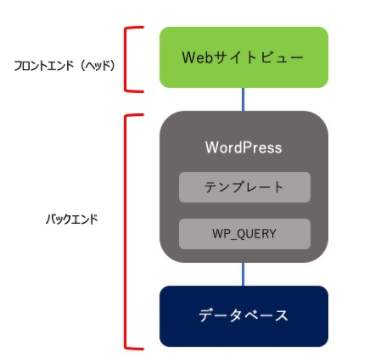
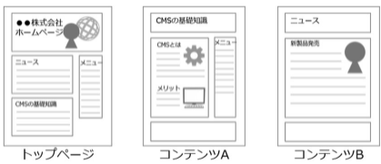
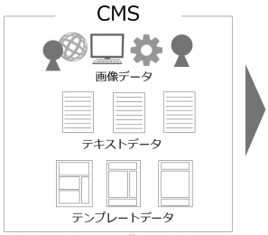

# Headless CMS について

## CMS とは

CMS（Content Manegement System）は、コンテンツ、ファイル、ワークフロー、リポジトリなどの情報を管理・公開するシステム

コンテンツデータを管理するバックエンドと、コンテンツデータを特定の HTML フォーマットに加工して出力するフロントエンド（ヘッド）に分かれている。

    

### CASE 1 : CMS 導入していない場合

HLTML・CSS や js 等を用いて 1 ページずつ完成形のデータを作成して保存・管理する

    

### CASE 2 : CMS 導入している場合

|                 |                        |
| --------------- | ---------------------- |
|  |  |

Web サイトに必要な画像やテキスト・テンプレート等のデータを個別に CMS で一元管理

DB に保存されている画像やテキストデータを元に CMS が組み立ててページを生成する

    
    

## HeadlessCMS

HeadlessCMS は Head を持たず、内容を管理する backend の機能だけを持ち、見た目を決めるテーマや CSS は持たない

