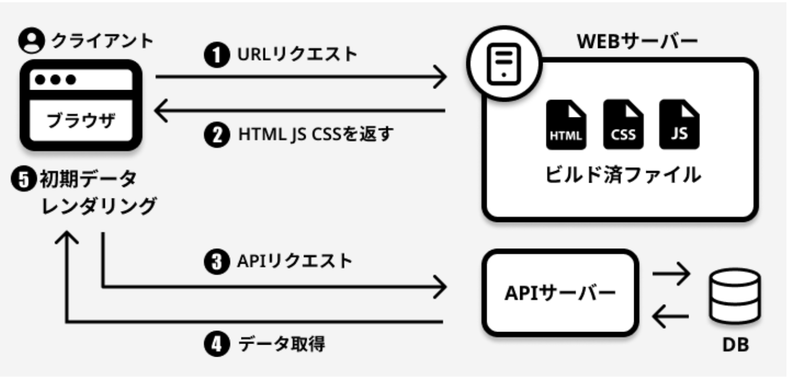
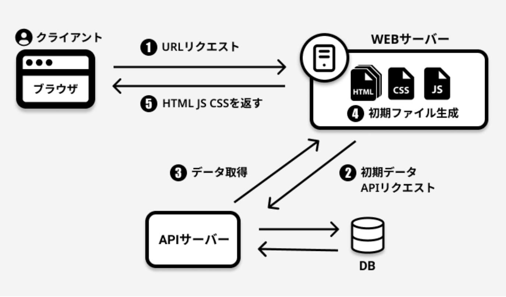
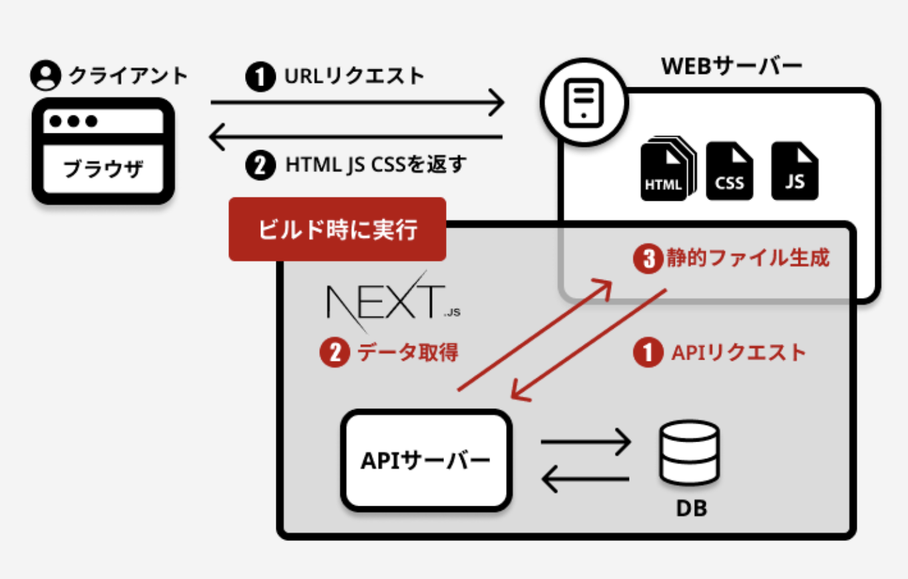

# レンダリングの比較

## Client Side Rendering

ユーザーのブラウザで全てレンダリングする方法

ブラウザからHTTPリクエストされると、サーバー側はビルドされたJSとCSS、中身ほぼ空っぽなHTMLファイルをHTTPレスポンスとして返す。

初回アクセス時はHTMLファイルの中身はほぼ空なので何も表示されず、その後初期データを取得してブラウザがHTMLをレンダリングする。

### メリット

- ページ遷移によるユーザーストレス軽減。（非同期で必要なデータを取得する場合を除く）

### デメリット

- JSファイルが実行、評価されてDOMがマウントされるまでコンテンツが何も表示されない
- JSファイルのサイズが大きくなると、ファイルダウンロードの時間がその分大きくなる

### 適したサービス

ユーザーが頻繁にページ遷移やコンテンツの操作するような滞在時間の長いサービスに適しているか

## Server Side Rendering

ブラウザではなくサーバサイドでレンダリングして、クライアントサイドで描画する方法

初回アクセス時はクライアント側からHTTPリクエストが送られて、APIからデータを取得する。
その後、サーバ内で動的にHTMLファイルを生成（Node.jsを実行）しHTTPレスポンスとしてレンダリング済のHTMLを返す。

### メリット
- サーバサイドでレンダリングするので、CPUやメモリーが少ないスマホなどのデバイスでも操作性に影響が少なく、ユーザーの通信環境に左右されにくい。

### デメリット
- SSRするためのNode.jsを実行出来るWebサーバーが必要
- サーバ側の負荷が高い

### 番外

秘匿情報が含まれたページがCDNにキャッシュされた場合、個人情報の漏洩などに繋がった事例

[メルカリの漏洩事件](https://engineering.mercari.com/blog/entry/2017-06-22-204500/)

### 適したサービス

コンテンツ更新頻度の高いサービスなど。動画投稿サービスやSNSサービス

## Static Site Generator

静的サイトジェネレーター。
アプリケーションのビルド時に、APIなどからデータを取得し、HTMLを最初に生成（プリレンダリング）し、 サーバーへのリクエストがあった場合には、この生成されたHTMLファイルを返却する

生成された各HTMLはそのページに必要最小限なJavaScriptコードと関連づけられ、ブラウザによってページが読み込まれると そのページに必要なJavaScriptコードが実行される

特商法ページのようにユーザーごとに表示するコンテンツが変わるわけではないような場合、
最初から静的なファイルとして用意しておけばよくね？という考え

### メリット

- CSR, SSRよりもレスポンスが高速。
- SEOに強い。
- 動的なOGP対応が可能。

### デメリット

- 外部からデータを取得している場合、外部データが更新されたタイミングで再ビルドを行わないと変更は反映されない
- 頻繁にデータ更新があるサイトには向かない

### 適したサービス

更新頻度の少ないブログやコーポレートサイト等

## Incremental Static Regeneration

ISRはインクリメンタル静的再生成という手法

基本的にはSSGの挙動と同じ
クライアント側のリクエストに対しビルド時に生成された静的ページを返し、 尚且、バックグラウンドで一定期間ごとに静的ページの再生成をサーバー側で行う

### メリット
- SSGのBuild時間を短縮可能
- SSRと比較したらDB負荷は軽め。

### デメリット
- vercel依存

### 適したサービス
常に最新の情報である必要性はないが適度な更新頻度のあるサービス。

